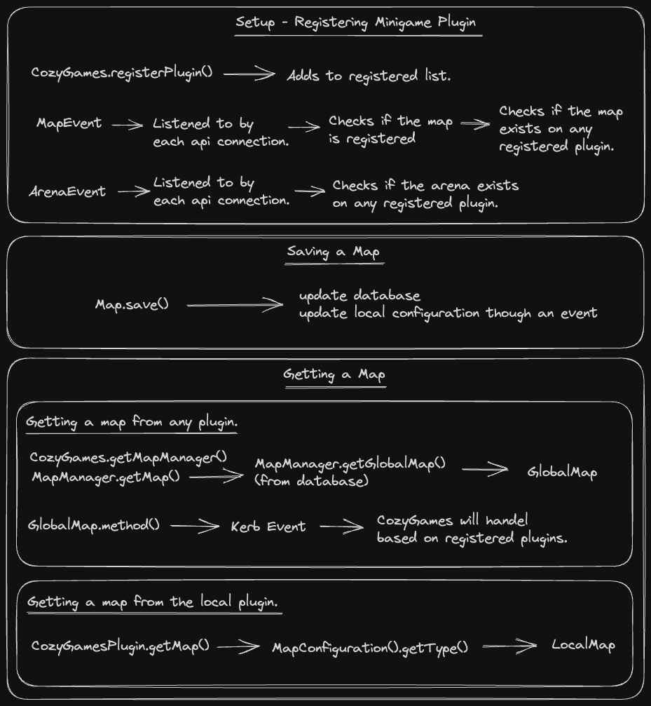

```yaml
name: CozyGamesAPI
description: The API used to interface with the cozy game system.
author: Smuddgge and Contributors
status: In Development
```

**Brief**

```
Ever wanted to have your very own mini-games Minecraft network?
This API is here to make it easy.

Drag and drop the API jar into a server, and boom!
Players will be able to join any game on the network.

Drag and drop a mini-game jar into a server, and boom!
All servers will now let players play that mini-game.
```

**How it works**

```
Once an map has been set up and a player starts a game, 
it will generate a new world and build the map.
```

# Developers

**Class Breakdown**

```yaml
CozyGames: The base api.
CozyGamesProvider: A way of obtaining the api.

CozyGameAPIPlugin: A api plugin.
CozyGamePlugin: A mini-game plugin.

Map: A mini-game map using positions. (A location without a specified world)
LocalMap: Simplified methods for mini-game plugins.
GlobalMap: A map that could be on a different server.

Arena: A map within a world using locations.
LocalArena: Simplified methods for mini-game plugins.
LocalBukkitArena: Simplified local arena for bukkit mini-game plugins.
GlobalArena: A arena that could be on a different server.

Session: A running game in an arena. (Arena with group instance)
SessionComponent: A process that can be running in a session. Providing a clean way of designing a mini-game.
```

**State Diagram**


